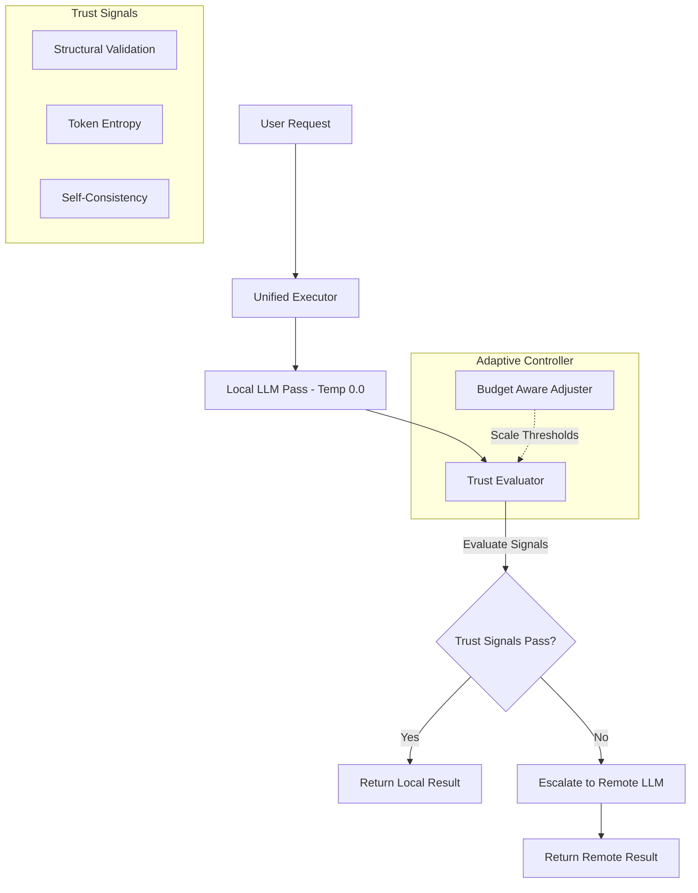

# Hybrid Model Router

The Hybrid Model Router is an intelligent routing framework designed to optimize LLM performance and token efficiency. It routes user queries dynamically between a lightweight local LLM (Qwen 2.5 0.5B running on Ollama) and a powerful remote LLM (Llama 3.1 70B running on Fireworks AI) depending on confidence metrics, budget pressures, and query difficulty.

---

## System Architecture

The router employs a modular design consisting of the following core layers:



### 1. Unified Executor (`routing_agent/executor.py`)
Acts as the central orchestrator. It manages the execution lifecycle:
* **Static Mode**: Runs queries strictly on local or remote models.
* **Dynamic Mode (v1)**: Runs the query locally at temperature 0, evaluates confidence, and cascades to the remote model only if confidence falls below the calibrated thresholds.
* **Adaptive Mode (v2)**: Incorporates real-time token budget pressure and category-specific history to scale confidence thresholds dynamically.

### 2. Trust Evaluator (`routing_agent/evaluator.py`)
Determines if a local response is trustworthy based on three signals:
* **Structural Validity**: Checks if the response compiles (Python syntax) or contains required keys (JSON schema).
* **Token Entropy**: Calculates average transition token log-probabilities to flag confidence drift.
* **Self-Consistency**: Queries the local model multiple times at high temperature (e.g., `temp=0.7`) to measure output convergence.

### 3. Budget-Aware Adjuster (`routing_agent/adjuster.py`)
Tracks execution telemetry to optimize resources dynamically:
* Calculates budget pressure ($P = \frac{\text{Target Burn Rate}}{\text{Actual Burn Rate}}$).
* Monitors category-specific historical accuracy by comparing local responses against remote responses (acting as proxy ground truth) when escalations occur.
* Dynamically increases confidence thresholds when the token budget is tight or when local model accuracy for the given category is high.

### 4. Verification Scorers (`routing_agent/scorer.py`)
Provides deterministic programmatic evaluators to score responses for validation tasks across categories: `math`, `reasoning`, `code`, and `structured_output`.

---

## Getting Started

### Prerequisites
* Docker and Docker Compose installed.
* A Fireworks AI API key (optional, simulation mode will run automatically if missing).

### Configuration
Set your Fireworks AI API key in your shell environment:
```bash
export FIREWORKS_API_KEY="your_api_key_here"
```

---

## Makefile Command Reference

The project includes a `Makefile` to simplify common development and execution tasks:

| Command | Description |
| :--- | :--- |
| `make build` | Builds the Docker image for the application. |
| `make up` | Starts the background services (including the local Ollama LLM server). |
| `make down` | Shuts down the running background docker containers. |
| `make logs` | Streams logs from active background services. |
| `make test` | Runs the full `pytest` suite inside the Docker container. |
| `make eval` | Runs the evaluation script comparing all routing strategies. |
| `make optimize` | Sweeps the parameter threshold space to calibrate optimal baseline settings. |
| `make clean` | Cleans up temporary Python compilation caches and run log files. |

---

## Development Workflows

### 1. Running Tests
Verify the installation by running the test suite:
```bash
make test
```

### 2. Calibrating Thresholds
If you modify the evaluation dataset or need to tune the trade-off between remote token spend and target accuracy:
```bash
make optimize
```
This runs a parameter grid sweep over the validation set and stores the optimized thresholds (minimizing remote tokens while maintaining a performance floor) in `routing_config.json`.

### 3. Evaluation Baseline
To run the full evaluation suite and generate accuracy and token usage comparison summaries for Local-Only, Hybrid-Calibrated, Adaptive-Router, and Remote-Only configurations:
```bash
make eval
```

---

## Telemetry & Logging

When running queries in dynamic or adaptive modes, the router logs diagnostics to a newline-delimited JSON (`routing_execution.jsonl`) file in the workspace directory. Each log entry contains:
* `timestamp`: ISO UTC representation.
* `prompt` and `category`: Context of the query.
* `routing_strategy`: `"static"`, `"dynamic"`, or `"adaptive"`.
* `source`: The final source utilized (`"local"`, `"remote"`, or `"local (fallback)"`).
* `local_tokens_used` & `remote_tokens_used`: Detailed token burn counts.
* `latency_seconds`: Execution duration.
* `trust_report`: Signals computed during evaluation (structural validity, entropy, consistency).
