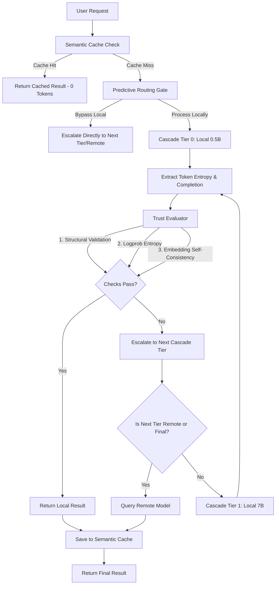

# Hybrid Model Router (HMR)

The Hybrid Model Router is a containerized, production-grade LLM routing agent designed to maximize accuracy while minimizing inference costs and latency. It acts as an intelligent traffic controller between a low-cost local model hierarchy (e.g., a lightweight Qwen 2.5 0.5B running on Ollama) and highly capable, commercial remote models (e.g., Llama 3 70B running on Fireworks AI).

By evaluating real-time confidence metrics, budget consumption, and query complexity, the router dynamically routes simple prompts to local instances, saving substantial API spend, and escalates to larger models only when local validation signals fail.

---

## Key Features & Enhancements

* **Multi-Tier Model Cascade:** Routes queries sequentially through a customizable list of models (e.g., Local 0.5B $\rightarrow$ Local 7B $\rightarrow$ Remote 70B) depending on confidence metrics at each stage.
* **Semantic Cache Layer:** Integrates a local vector cache that maps prompt embeddings to prior outputs, serving repeated or highly similar queries instantly with zero token consumption.
* **Predictive Routing Gate:** Bypasses local processing entirely for complex prompts by using keyword checks, length analysis, and domain classification rules.
* **Real-time Budget Adaptation:** Adjusts confidence thresholds dynamically based on target token burn-rate limits and sliding-window historical performance.
* **Embedding-Based Self-Consistency:** Upgrades raw text consistency evaluations by computing cosine similarity over sentence embeddings to verify model response reliability.

---

## System Architecture

The workflow below illustrates the path of an incoming query under the `dynamic` or `adaptive` routing modes:



---

## Detailed Component Walkthrough

### 1. Unified Executor & Cascade Engine (`routing_agent/executor.py`)
The `UnifiedExecutor` orchestrates the lifecycle of a request. It supports three strategies:
* **`static`:** Direct execution on either the local or remote client.
* **`dynamic`:** Core multi-model cascade logic. It queries the local model, evaluates trust, and conditionally escalates to higher tiers.
* **`adaptive`:** Dynamically scales trust thresholds before executing the cascade loop based on real-time budget telemetry.

The cascade engine is fully customizable. You can configure a chain of models of arbitrary depth. When a tier fails to meet the required trust score, the executor automatically advances to the next tier. If a higher-tier model queries fail, it falls back gracefully to the highest-confidence local completion rather than throwing an exception.

### 2. Trust Evaluator & Signals (`routing_agent/evaluator.py`)
Before accepting a local completion, the `TrustEvaluator` verifies three primary metrics:
* **Structural Validation:** Parses syntax structures for programming tasks (e.g., verifying Python code compiles) or schema structures for structured outputs (e.g., verifying JSON contains required keys).
* **Token Entropy:** Evaluates transition log-probabilities. High average token entropy indicates that the local model was highly uncertain during text generation.
* **Self-Consistency:** Generates $N$ alternative responses at a higher temperature (e.g., `temp=0.7`) and calculates the cosine similarity between their sentence embeddings. A low similarity score flags model hallucination or high output variance.

### 3. Semantic Cache (`routing_agent/cache.py`)
To prevent redundant API queries, the `SemanticCache` class stores previous query embeddings alongside their results in a local file (`semantic_cache.json`). 
* When a query arrives, its embedding is generated using Ollama's local embedding API.
* The cache computes the cosine similarity between the incoming query embedding and all cached prompt embeddings.
* If the similarity exceeds a set threshold (default: `0.95`), the cached result is returned immediately as a `"cache hit"` with zero additional tokens spent.

### 4. Predictive Gate (`routing_agent/gate.py`)
A lightweight routing classifier that identifies hard queries (such as advanced calculus, complex system design, or large code refactoring requests) before invoking the local model.
* It uses heuristic indicators (prompt length, presence of domain-specific keywords).
* If a query triggers the predictive gate, the executor skips the first local model tier and routes the request directly to the next tier.

### 5. Budget Aware Adjuster (`routing_agent/adjuster.py`)
The `BudgetAwareAdjuster` tracks token burn rates and budget consumption.
* It calculates budget pressure ($P = \frac{\text{Target Burn Rate}}{\text{Actual Burn Rate}}$).
* When token spend exceeds target limits, it scales down the trust thresholds to permit slightly lower-confidence local responses, conserving budget.
* When excess budget is available, it raises thresholds to route more queries to the remote LLM, optimizing for maximum response quality.

---

## Getting Started

### Prerequisites
* **Docker** and **Docker Compose** installed.
* An API Key for your remote model provider (Fireworks AI, OpenAI, or Google Gemini).

### Configuration
Create a `.env` file in the root directory by copying the example environment file:
```bash
cp .env.example .env
```
Open `.env` and fill in the API key corresponding to the remote provider you plan to use:
* **Fireworks AI:** Set `FIREWORKS_API_KEY` (default remote model provider).
* **OpenAI:** Set `OPENAI_API_KEY` (if routing to GPT models).
* **Google Gemini:** Set `GEMINI_API_KEY` or `GOOGLE_API_KEY` (if routing to Gemini models).

*Note: If no API keys are provided, the evaluation/benchmark suite will automatically fall back to **simulation mode**, running mock inferences with zero costs.*

---

## Makefile Command Reference

The project includes a `Makefile` to simplify command executions:

| Command | Description |
| :--- | :--- |
| `make build` | Builds the Docker container for the routing agent. |
| `make up` | Boots the Ollama model server container in the background. |
| `make down` | Shuts down background containers. |
| `make logs` | Streams logs from background containers. |
| `make test` | Runs the full unit test suite (38+ tests) inside the Docker container. |
| `make eval` | Runs the benchmark evaluation comparing routing strategies. |
| `make optimize` | Sweeps the threshold parameter space to calibrate optimal baselines. |
| `make clean` | Removes compiled Python caches and temporary log files. |

---

## Developer Usage

### 1. Basic Routing Example
Below is an example showing how to initialize and execute queries using the hybrid model router:

```python
from routing_agent.executor import UnifiedExecutor

# Initialize the executor (loads optimized thresholds from routing_config.json if available)
executor = UnifiedExecutor()

# Run a query with dynamic routing
result = executor.execute(
    prompt="What is the derivative of x^2 + 5x?",
    routing_strategy="dynamic",
    category="math"
)

print(f"Response: {result.text}")
print(f"Source: {result.source}")  # 'local', 'remote', or 'cache hit'
print(f"Tokens Spent: Local={result.local_tokens_used}, Remote={result.remote_tokens_used}")
```

### 2. Custom Multi-Model Cascade
You can pass custom cascade configurations to the executor constructor:

```python
from routing_agent.executor import UnifiedExecutor
from routing_agent.local_client import LocalClient
from routing_agent.remote_client import RemoteClient

# Initialize custom model instances
local_small = LocalClient(model="qwen2.5:0.5b")
local_medium = LocalClient(model="llama3:8b")
remote_large = RemoteClient(model="accounts/fireworks/models/llama-v3p1-70b-instruct")

# Define a 3-tier cascade
custom_cascade = [
    {"client": local_small, "type": "local", "name": "local-0.5B"},
    {"client": local_medium, "type": "local", "name": "local-8B"},
    {"client": remote_large, "type": "remote", "name": "remote-70B"}
]

executor = UnifiedExecutor(cascade=custom_cascade)

result = executor.execute(
    prompt="Design a distributed key-value store architecture.",
    routing_strategy="dynamic",
    category="reasoning"
)
```

---

## Telemetry & Diagnostics

Every execution under `dynamic` or `adaptive` modes is written to a structured, newline-delimited JSON file (`routing_execution.jsonl`). Each line captures:
```json
{
  "timestamp": "2026-07-08T15:23:44Z",
  "prompt": "Write a python function to compute fibonacci numbers.",
  "category": "code",
  "routing_strategy": "dynamic",
  "source": "local",
  "local_tokens_used": 42,
  "remote_tokens_used": 0,
  "latency_seconds": 0.85,
  "trust_report": {
    "escalate": false,
    "signals": {
      "structural_valid": true,
      "mean_entropy": 0.12,
      "self_consistency": 0.98
    },
    "failures": {
      "structural": false,
      "entropy": false,
      "consistency": false
    }
  }
}
```
Use this log file to analyze system performance, monitor API costs, or gather datasets to further calibrate routing thresholds.
