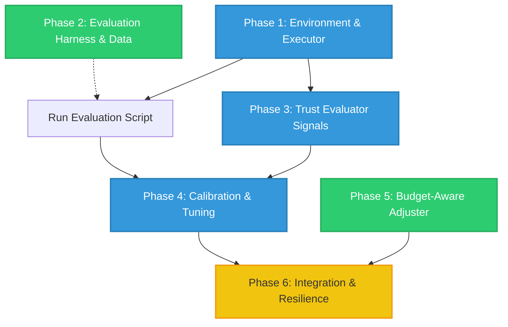

# Project Todo List: Hybrid Token-Efficient Routing Agent

Welcome! This document outlines the development workflow and implementation phases for the Hybrid Token-Efficient Routing Agent.

---

## Developer & AI Agent Guidelines

To maintain codebase stability, prevent regressions, and facilitate collaboration, all developers and AI agents must strictly follow these workflow and testing standards:

### 1. Development Workflow
* **Branching**: For every new feature or task, create a new branch from `main`. Use a descriptive name:
  - Feature: `git checkout -b feature/your-feature-name`
  - Task/Bug: `git checkout -b task/task-description`
* **Merge**: Submit a Pull Request or merge into `main` **only** after all unit/integration tests and verification steps pass successfully.

### 2. Mandatory Testing Standards
Every feature or task must be thoroughly tested before merging. Depending on the component, you must implement and run tests using these methods:
* **Mock-Driven Unit Testing (`pytest` + `unittest.mock`)**:
  * Never make real LLM or API calls in unit tests. Mock local inference engines (Ollama/llama.cpp) and remote endpoints (Fireworks AI).
  * Explicitly test behavior under mock exceptions (HTTP errors, timeouts, rate limits) and malformed outputs (empty strings, corrupt JSON).
* **Contract-Based & Type Safety Validation (`mypy` / `Pydantic`)**:
  * Ensure all component interfaces strictly adhere to typed data schemas (`Pydantic` or `dataclasses`) to prevent changes in one task from silently breaking down-stream dependencies.
* **Property-Based Testing (`hypothesis`)**:
  * For algorithms handling continuous calculations or infinite states (e.g., Phase 5 Adjuster), use property-based testing to automatically generate hundreds of edge-case states and verify safety invariants (e.g., division-by-zero, bounds checking, NaN values).
* **Golden Regression Suites**:
  * Run modifications against a fixed, deterministic set of mock tasks to ensure routing decisions do not randomly diverge from baseline expectations.
* **Chaos Testing**:
  * For resilience features, run integration tests that randomly inject network flakes/failures and verify the router handles it gracefully without crashing.

---

## Implementation Phases & Parallelizability

To maximize development velocity, entire phases or large blocks of work have been designed to be developed in parallel.

### Parallel Development Roadmap



- **🟢 Green Nodes (Phase 2 & Phase 5) are FULLY PARALLELIZABLE**:
  - **Phase 2 (Evaluation Harness)** requires zero model API access to build the test datasets and writing scoring scripts.
  - **Phase 5 (Budget-Aware Adjuster)** is a purely mathematical state-machine that does not depend on model integration and can be fully developed/unit-tested in isolation using mock inputs.
- **🔵 Blue Nodes (Phase 1, 3, & 4) must be done sequentially** (or partially in parallel if using mock endpoints).
- **🟡 Yellow Node (Phase 6) is the final integration** requiring all components.

---

### Phase 1: Environment & Executor Foundation [Sequential Branch]
*Goal: Establish local and remote model connections, and create basic execution interfaces.*

- [x] **Task 1.1: Local Model Server Setup**
  - Select and set up a lightweight local runtime (e.g., Ollama or llama.cpp).
  - Download and configure a small instruction-tuned model (0.5B–3B parameters) suitable for target hardware.
- [x] **Task 1.2: Local Executor Client**
  - Implement a client in Python to query the local model server.
  - Handle standard prompt formatting and basic response parsing.
- [x] **Task 1.3: Token & Entropy Extraction**
  - Extract and parse token logprobs and entropy from the local model's API responses (required for the entropy signal).
- [ ] **Task 1.4: Fireworks AI Remote Client**
  - Implement a remote executor using the Fireworks AI client library.
  - Set up authentication via environment variables and verify token consumption tracking.
- [ ] **Task 1.5: Unified Executor Interface**
  - Write a high-level router entry point that can direct a task to either the local or remote client based on a routing flag.

---

### Phase 2: Evaluation Harness & Test Data [Parallelizable Phase]
*Goal: Build the testing infrastructure needed to score the router's accuracy and token cost.*
*This phase is fully independent of Phase 1 and can be developed concurrently.*

- [ ] **Task 2.1: Mini Dataset Curation**
  - Construct a diverse validation set mimicking expected task categories (e.g., math, code, reasoning, structured output).
- [ ] **Task 2.2: Evaluator Scorer**
  - Write scoring helpers for exact match, formatting checks (JSON parses), and semantic similarity.
- [ ] **Task 2.3: Evaluation Run Script**
  - Create a main script that runs the validation set through the local/remote models, aggregates accuracy scores, and logs token usage.
  - Output baseline performance results (Local-Only vs. Remote-Only).
  *Note: Only executing this script requires Phase 1 to be complete.*

---

### Phase 3: Trust Evaluator (Signals & Decision Logic v1) [Sequential Branch]
*Goal: Implement multiple statistical and structural verification signals to decide if the local answer is reliable.*
*Depends on Phase 1 for live model responses/entropy.*

- [ ] **Task 3.1: Self-Consistency Signal (Signal 1)**
  - Implement a local sampling runner that queries the local model $N$ times at temperature $> 0$.
  - Calculate consistency/agreement score (e.g., exact match frequency for short outputs or similarity metrics for free text).
- [ ] **Task 3.2: Entropy / Logprob Signal (Signal 2)**
  - Implement scoring based on token-level entropy/logprobs retrieved in Task 1.3.
- [ ] **Task 3.3: External/Structural Verification Signal (Signal 3)**
  - Write format check utilities (e.g., JSON validator, regex constraints, and code compilation checkers).
- [ ] **Task 3.4: Trust Evaluator Logic v1**
  - Combine the signals into a unified OR-based routing decision rule:
    ```python
    escalate = (self_consistency < consistency_threshold) or (entropy > entropy_threshold) or structural_failed
    ```

---

### Phase 4: Threshold Tuning & Optimization [Sequential Branch]
*Goal: Optimize static thresholds using the evaluation harness to find the best accuracy-to-token trade-off.*
*Depends on Phase 2 & Phase 3.*

- [ ] **Task 4.1: Sweep Optimizer Script**
  - Write a search/optimization script to sweep through combinations of `consistency_threshold` and `entropy_threshold`.
- [ ] **Task 4.2: Calibration**
  - Run the sweep on the evaluation dataset. Find thresholds that minimize Fireworks tokens while maintaining the accuracy floor with a safety margin.
- [ ] **Task 4.3: Performance Validation**
  - Compare the calibrated v1 router against the local-only and remote-only baselines and document the gains.

---

### Phase 5: Budget-Aware Adjuster (v2 Stretch Goal) [Parallelizable Phase]
*Goal: Dynamically adjust thresholds over the course of execution based on token budget pressure and category-specific history.*
*This phase is a purely mathematical state-machine and can be developed/unit-tested completely in parallel with Phases 1, 2, 3, and 4.*

- [ ] **Task 5.1: Category Reliability Tracker**
  - Set up real-time bookkeeping to monitor local model reliability (success/failure) across different task categories.
- [ ] **Task 5.2: Budget Pressure Calculator**
  - Create a utility to track elapsed tokens and estimate remaining budget relative to the remaining task count.
- [ ] **Task 5.3: Adaptive Adjuster Integration**
  - Implement dynamic threshold adjustment: raise thresholds (trust local more) when budget pressure is high or category reliability is high; lower thresholds (escalate more) otherwise.
- [ ] **Task 5.4: A/B Testing vs. v1**
  - Compare the adaptive v2 adjuster against the static v1 router. Keep v1 as the default/fallback if v2 does not show a clear performance boost.

---

### Phase 6: Production Resilience & Final Integration [Final Phase]
*Goal: Ensure system robustness to API issues and clean up the code for submission.*
*Depends on all previous phases.*

- [ ] **Task 6.1: Fireworks API Fallback**
  - Implement error-handling, timeouts, and automatic retries for Fireworks AI calls. If the remote API fails repeatedly, fall back to returning the local answer.
- [ ] **Task 6.2: Execution Logging**
  - Set up structured logs (e.g., JSONL) outputting final decisions, routing signals, latency, and costs for production run diagnostics.
- [ ] **Task 6.3: Code Cleanup & Submission Prep**
  - Clean up experimental scripts, update setup/dependency configurations, and write the final execution instructions.
